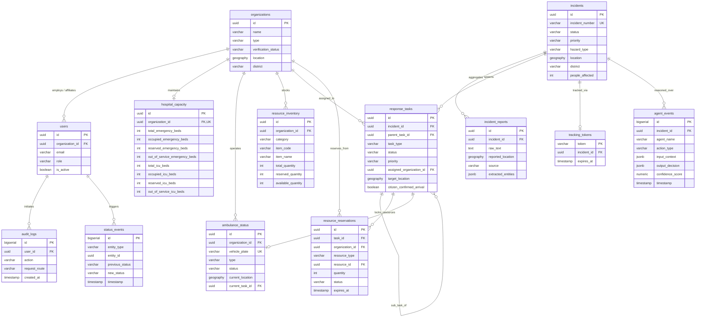

# RESQ — Entity Relationship Diagram

The diagram below maps all relational links, foreign keys, cardinality, and constraints across the RESQ persistence layer.

```mermaid
erDiagram
    organizations ||--o{ users : "employs / affiliates"
    organizations ||--o| hospital_capacity : "maintains"
    organizations ||--o{ ambulance_status : "operates"
    organizations ||--o{ resource_inventory : "stocks"
    organizations ||--o{ response_tasks : "assigned_to"
    organizations ||--o{ resource_reservations : "reserves_from"

    incidents ||--o{ incident_reports : "aggregates"
    incidents ||--o{ response_tasks : "spawns"
    incidents ||--o| tracking_tokens : "tracked_via"
    incidents ||--o{ agent_events : "reasoned_over"

    response_tasks ||--o{ response_tasks : "sub_task_of"
    response_tasks ||--o{ resource_reservations : "locks_resources"
    response_tasks ||--o| ambulance_status : "executes"

    users ||--o{ audit_logs : "initiates"
    users ||--o{ status_events : "triggers"

    organizations {
        uuid id PK
        varchar name
        varchar type
        varchar verification_status
        geography location
        varchar district
    }

    users {
        uuid id PK
        uuid organization_id FK
        varchar email
        varchar role
        boolean is_active
    }

    incidents {
        uuid id PK
        varchar incident_number UK
        varchar status
        varchar priority
        varchar hazard_type
        geography location
        varchar district
        int people_affected
    }

    incident_reports {
        uuid id PK
        uuid incident_id FK
        text raw_text
        geography reported_location
        varchar source
        jsonb extracted_entities
    }

    tracking_tokens {
        varchar token PK
        uuid incident_id FK
        timestamp expires_at
    }

    response_tasks {
        uuid id PK
        uuid incident_id FK
        uuid parent_task_id FK
        varchar task_type
        varchar status
        varchar priority
        uuid assigned_organization_id FK
        geography target_location
        boolean citizen_confirmed_arrival
    }

    hospital_capacity {
        uuid id PK
        uuid organization_id FK, UK
        int total_emergency_beds
        int occupied_emergency_beds
        int reserved_emergency_beds
        int out_of_service_emergency_beds
        int total_icu_beds
        int occupied_icu_beds
        int reserved_icu_beds
        int out_of_service_icu_beds
    }

    ambulance_status {
        uuid id PK
        uuid organization_id FK
        varchar vehicle_plate UK
        varchar type
        varchar status
        geography current_location
        uuid current_task_id FK
    }

    resource_inventory {
        uuid id PK
        uuid organization_id FK
        varchar category
        varchar item_code
        varchar item_name
        int total_quantity
        int reserved_quantity
        int available_quantity
    }

    resource_reservations {
        uuid id PK
        uuid task_id FK
        uuid organization_id FK
        varchar resource_type
        uuid resource_id FK
        int quantity
        varchar status
        timestamp expires_at
    }

    status_events {
        bigserial id PK
        varchar entity_type
        uuid entity_id
        varchar previous_status
        varchar new_status
        timestamp timestamp
    }

    agent_events {
        bigserial id PK
        uuid incident_id FK
        varchar agent_name
        varchar action_type
        jsonb input_context
        jsonb output_decision
        numeric confidence_score
        timestamp timestamp
    }

    audit_logs {
        bigserial id PK
        uuid user_id FK
        varchar action
        varchar request_route
        timestamp created_at
    }
```
